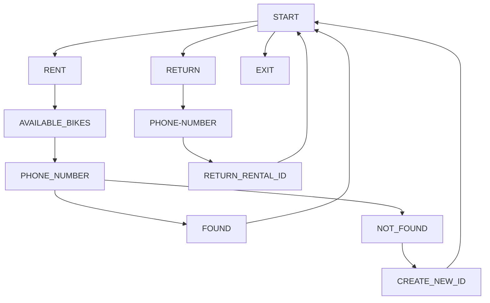

~~ DATABASE INFO! ~~

Database details

~~ TABLE INFO! ~~

Customer table info

Bikes table info

Rentals table info

~~ TABLE DATA! ~~

Customers Data

Bikes Data

Rental Data

~~ WORKING! ~~

https://github.com/wizfury/bike-rental-shop/assets/68225960/e499245f-87b1-4fa7-9ba9-c92fac0d24e5

Here is a simple flow chart:

